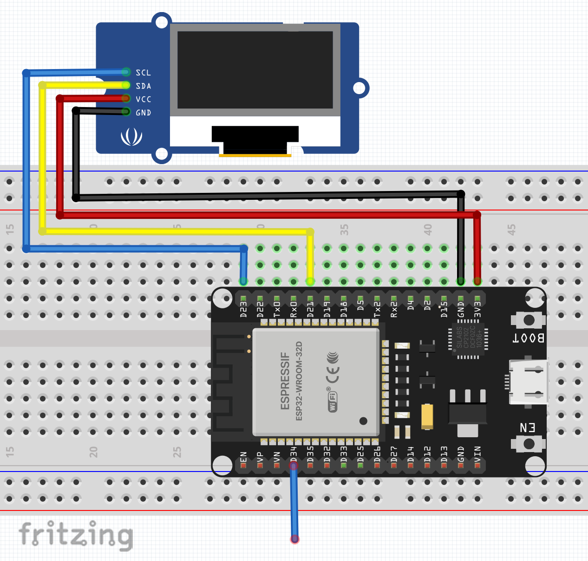

# ESP32 FFT TIME

Proyecto: **Captura y visualización de señales con el ADC interno del ESP32 + FFT + dashboard web + OLED**

Desarrollado y documentado por [alvaro-salazar](https://github.com/alvaro-salazar)

---

## ¿Qué hace este proyecto?

- Lee señales analógicas (0‑3.3 V) usando I²S + ADC interno del ESP32.
- Procesa bloques de 1024 muestras con FFT en el segundo núcleo.
- Visualiza en tiempo real la señal y su espectro (dB) en un dashboard web moderno y en una pantalla OLED.
- Todo el código es abierto, modular y fácil de modificar.

---

## Requisitos rápidos

- Placa ESP32 DevKit (cualquier WROOM/WROVER).
- VS Code + extensión PlatformIO.
- Navegador moderno (Chrome, Edge, Firefox).
- Pantalla OLED I2C (opcional, pero recomendado).
- Cable USB decente.

---

## Conexiones




## Cómo clonar y abrir

```sh
git clone https://github.com/alvaro-salazar/esp32-fft-web.git
cd esp32-fft-web
code .
```
PlatformIO detecta el proyecto al abrir VS Code.

---

## Librerías (se descargan solas)

- arduinoFFT
- ESP Async WebServer
- AsyncTCP
- Adafruit SSD1306 (para OLED)
- Adafruit GFX

No tienes que instalar nada manualmente, `platformio.ini` ya lo gestiona.

---

## Compilar y flashear

1. Compilar y subir firmware:
   ```sh
   pio run -t upload
   ```
2. Subir los archivos web (carpeta `data/`):
   ```sh
   pio run -t uploadfs
   ```
3. Pulsa RESET en la placa.

---

## Abrir el dashboard

- **Modo AP:** el ESP crea la red **FFT‑ESP32**. Conéctate y abre `http://192.168.4.1/`.
- **Modo STA:** (si configuras tu Wi‑Fi) mira la IP en el monitor serie, por ejemplo: `http://192.168.0.23/`.
- También responde por mDNS: `http://fft32.local/` (en algunos sistemas necesitas Bonjour/Avahi).

---

## Estructura de carpetas

```
src/        Código principal (main.cpp, tareas, drivers)
data/       index.html + assets web
include/    headers opcionales
platformio.ini
README.md   este archivo
```

---

## Flujo del código

- Core 0: lee el ADC vía I²S DMA → cola FreeRTOS.
- Core 1: procesa bloques de 1024 puntos → ventana Hamming + FFT.
- Calcula la magnitud y la manda junto al bloque de tiempo crudo por WebSocket.
- `index.html` dibuja dos gráficas con Chart.js:
  - Voltaje en tiempo (0‑3.3 V).
  - FFT en eje vertical dB (0 dB arriba, –120 dB abajo).
- El dashboard es responsive: se adapta a móvil y a pantalla full‑HD.
- La pantalla OLED muestra el espectro en tiempo real, con autoescalado y etiquetas útiles.

---

## Cosas por hacer / ideas

- Agregar filtrado FIR/IIR en tiempo real (el código ya tiene el punto exacto para insertarlo).
- Guardar los datos en microSD.
- Enviar por MQTT a un broker externo.
- Usar un front‑end analógico real (ADS1299) para EEG serio.
- Mejorar la visualización OLED con animaciones o más info.

---

## Autor

**Alvaro Salazar**  
[github.com/alvaro-salazar](https://github.com/alvaro-salazar)

© 2025
